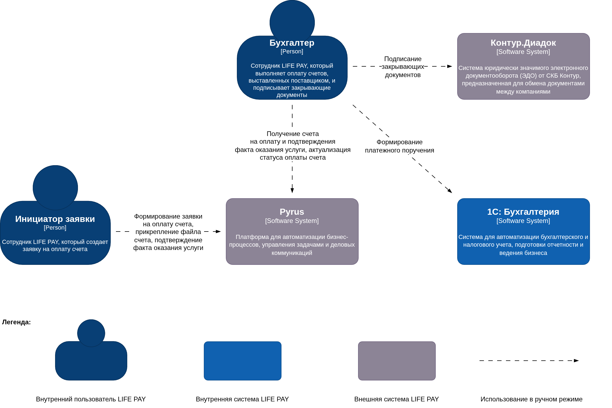
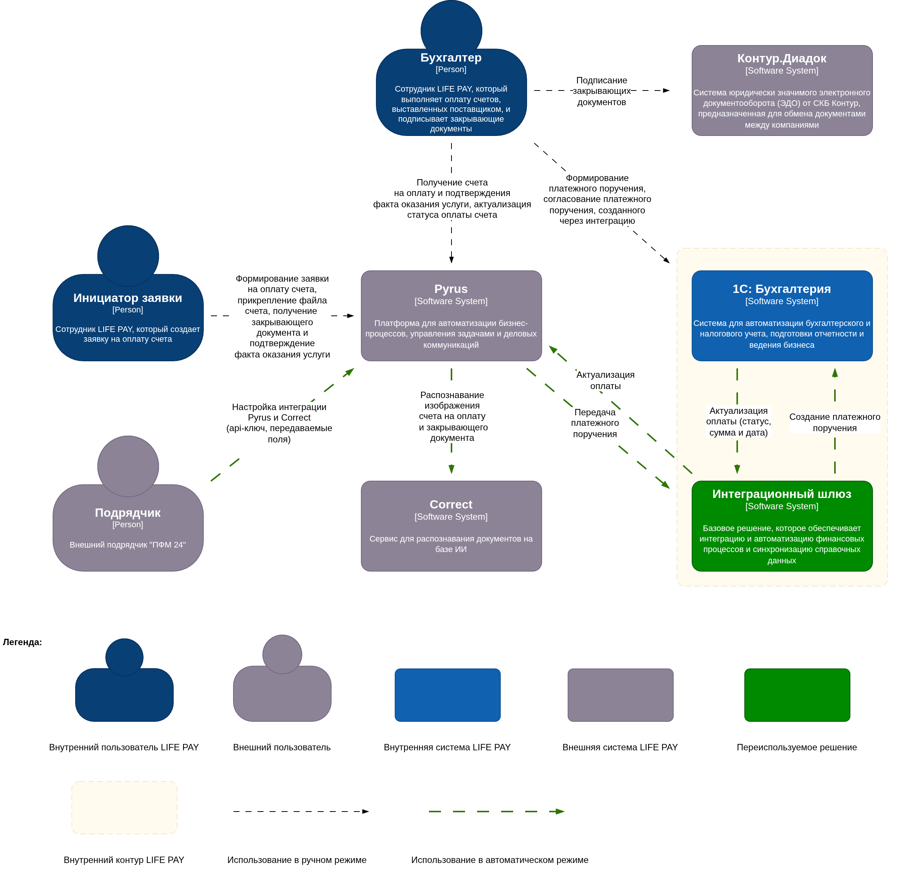
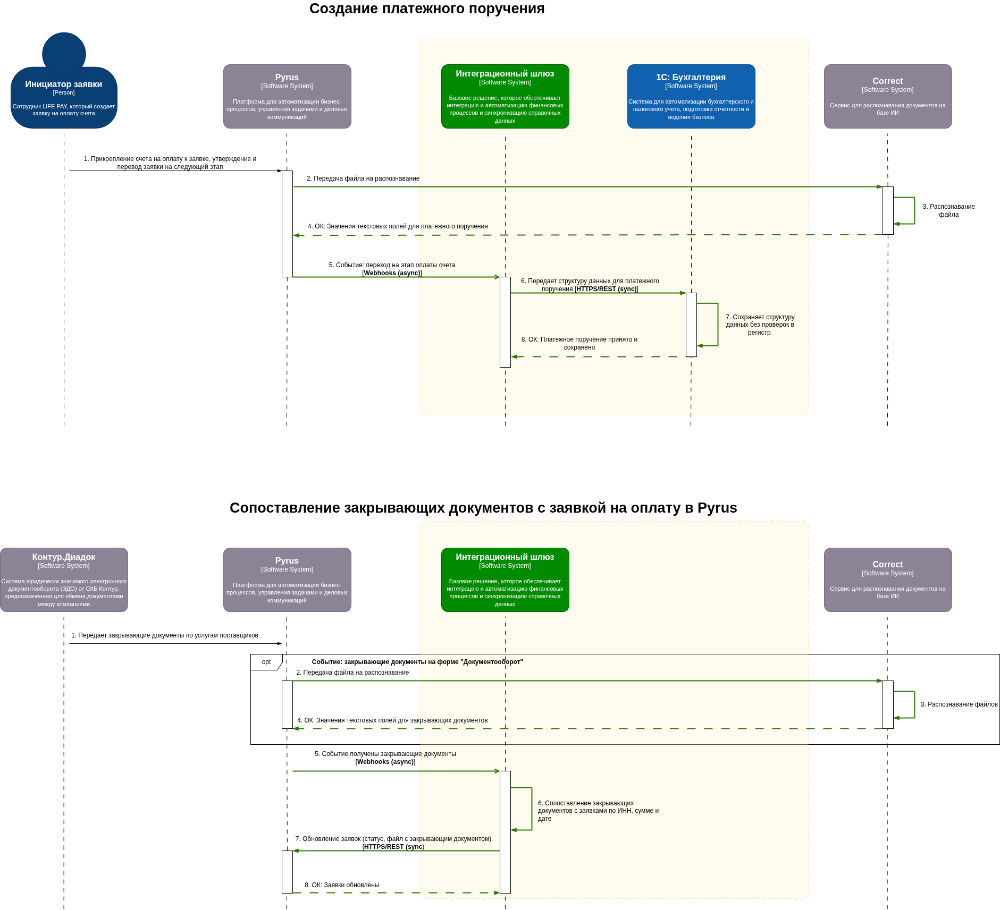

# RFC-0012: Интеграция Pyrus и Correct для распознавания документов

> **Источник:** [Confluence](https://bz.incdb.team/pages/viewpage.action?pageId=3421831711)

**Автор:** Киреева Софья

**Дата принятия:** 2026-04-29

**Срок действия:** 2026-04-29

**Начало реализации:** 2026-03-18

**Статус:** Approved

---

Проблема
--------

Сквозные финансовые процессы в Pyrus построены таким образом, что специалисты из бухгалтерии вынуждены в ручном режиме переносить информацию по счету в платежное поручение (1С:Бухгалтерия), а затем вручную отправлять инициаторам (которые создают заявку в Pyrus) закрывающие документы из ЭДО (Диадок). Инициаторы вручную указывают в заявке Pyrus суммы, даты оплаты и другую информацию по счету, которая уже есть в счете или закрывающих документах.

---

Предлагаемое решение
---------------------

Для сокращения количества ручных операций, ускорения финансовых процессов и автоматизации сопоставления с уже заведённой инициатором заявкой в Pyrus на оплату без вовлечения бухгалтерии предлагается использовать сервис распознавания документов на базе ИИ — [Correct](https://correct.su/#submenu:Solutions).

В среднем в Pyrus проходят 150 заявок на оплату в месяц. Стоимость пакета распознаваемых документов для среднего количества указанных заявок не будет превышать 15 500 руб. (НДС не облагается, начальный пакет). При данном количестве заявок начального пакета хватит на использование в течение года.

Сервис Correct предоставляется по модели SaaS.

Сервис Correct интегрируется через [нативное расширение](https://pyrus.com/t#marketplace/all/custom1297) в Pyrus.

Интеграция 1С и Pyrus строится через [Интеграционный шлюз (RFC-0011)](RFC-0011.md).

### Схема AS IS

### Схема TO BE

### Как работает интеграция

---

### Потоки данных

Ниже описаны данные, обрабатываемые на стороне Correct:

| # | Процесс | Направление потока | Описание |
|---|---------|-------------------|----------|
| 1 | Создание платежного поручения | Pyrus → Correct | **Счёт на оплату:** тип документа, номер, дата, наименование/адрес/ИНН/КПП исполнителя и заказчика, валюта (наименование и код), суммы (с налогом, без налога, налог), БИК, банк, расчётный и корреспондентский счёт, номер и дата договора, признак «цена включает НДС», табличная часть (артикул, код и наименование ед. изм., наименование позиции, кол-во, цена, цена с НДС, ставка НДС, сумма НДС, сумма с НДС). |
| 2 | Сопоставление закрывающих документов | Pyrus → Correct | **Акт о выполненных работах:** тип документа, номер, дата, реквизиты исполнителя и заказчика, валюта, итоговые суммы, договор, табличная часть (наименование, ед. изм., кол-во, цена, суммы с/без НДС). |
|   |   |   | **УПД:** тип документа, номер, дата, реквизиты поставщика/грузоотправителя/грузополучателя/плательщика (наименование, адрес, ИНН, КПП, банк, БИК, расчётный и корреспондентский счёт), основание, валюта, итоговые суммы, статус, приложение/доп. соглашение/заказ/договор (номер и дата), табличная часть (артикул, код позиции, наименование, ед. изм., кол-во, цена, суммы, НДС, страна, №ГТД). |
|   |   |   | **Счёт-фактура:** тип документа, номер, дата, реквизиты поставщика/грузоотправителя/грузополучателя/плательщика, документ об отгрузке, валюта, итоговые суммы, основание, приложение/доп. соглашение/заказ/договор, табличная часть (наименование, ед. изм., кол-во, цена, суммы, НДС, страна, №ГТД). |

---

Альтернативы (кратко)
---------------------

| # | Альтернатива | Почему не выбрана |
|---|-------------|-------------------|
| 1 | Самостоятельная разработка алгоритмов распознавания документов | Отсутствует ресурс для разработки у команды процессного офиса. |
| 2 | Ничего не делать | Без распознавания физических документов не будет реализована функциональность по автоматизации ручных операций сквозного процесса, за реализацию которого платится внешнему подрядчику — компании «ПФМ24». Не будут соблюдены требования бизнес-заказчика (директора по эффективности) — максимальное сокращение количества ручных операций. |
| 3 | Другие сервисы: [Beorg](https://beorg.ru/kadrovye-buhgalterskie-documenty/), [Smart Engines](https://smartengines.ru/), [СБИС (Saby) Распознавание](https://saby.ru/autorecognition) | У Pyrus нет встроенной интеграции с указанными сервисами. Для разработки интеграции самостоятельно у команды процессного офиса нет ресурса разработки. |

---

Компромиссы / Технический долг
------------------------------

* **Безопасность vs Стоимость разработки.** Передача коммерческой информации третьим лицам (SaaS-сервис Correct обрабатывает финансовые документы компании).

---

Влияние на другие команды
-------------------------

| Команда | Влияние |
|---------|---------|
| ИТ | Закупка сервиса Correct, периодический мониторинг фактического расхода купленного пакета страниц для повторной закупки при израсходовании пакета. |
| Внешний подрядчик «ПФМ 24» | Настройка n8n, настройка интеграции Pyrus и Correct, написание ботов, необходимых для функционирования процессов: создание платежного поручения, сопоставление закрывающих документов с заявкой на оплату в Pyrus. |
| ИТ | Поддержка работоспособности, сопровождение n8n и ботов для процессов: создание платежного поручения, сопоставление закрывающих документов с заявкой на оплату в Pyrus. |
| Внешний исполнитель (будет определён при возникновении потребности) | Развитие функционала решения. |

---

Ссылки
------

* [RFC-0011: Интеграция Pyrus и 1С через n8n](RFC-0011.md)
