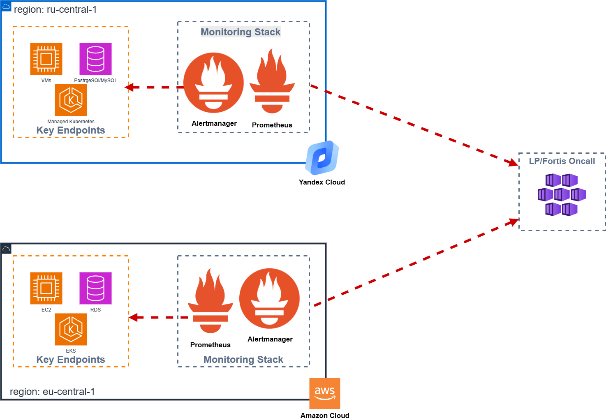
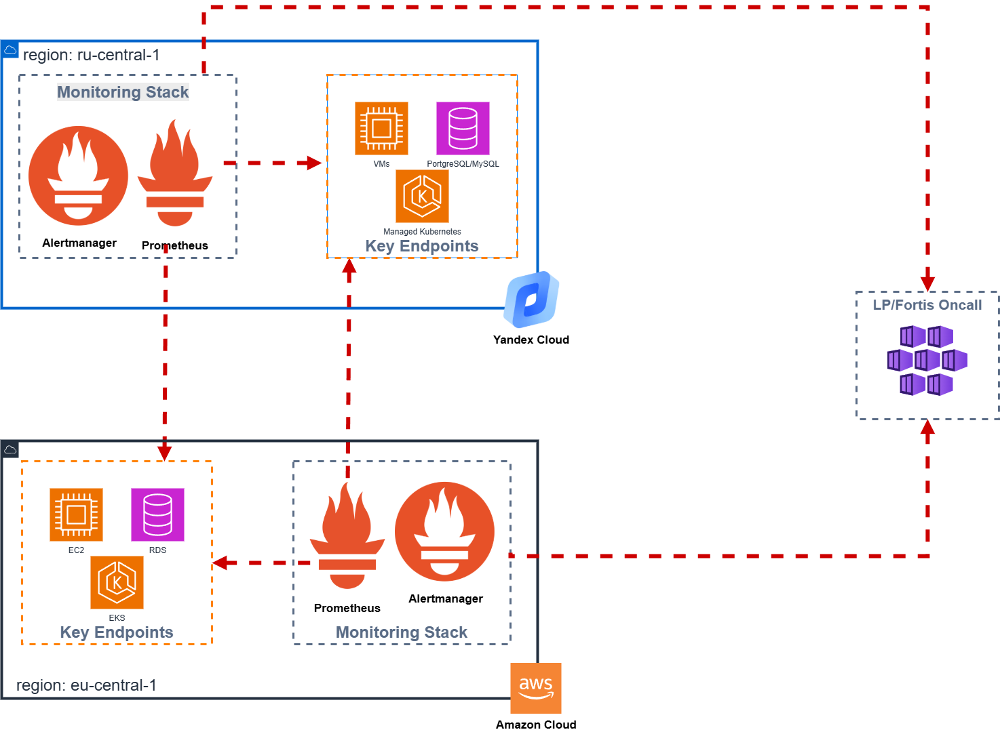
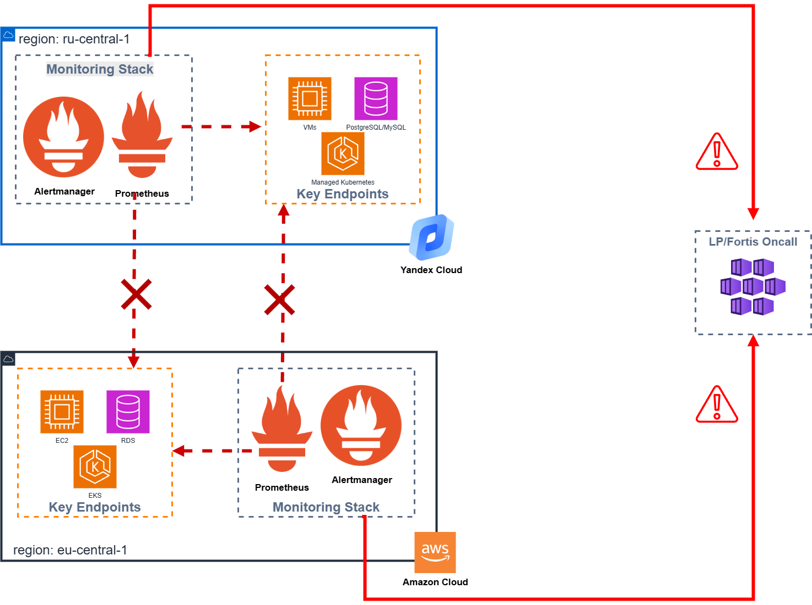

# RFC-0013: Взаимный кросс-мониторинг ключевых эндпоинтов между AWS и Yandex Cloud

> **Источник:** [Confluence](https://bz.incdb.team/pages/viewpage.action?pageId=3423764705)

**Автор:** Небараков Михаил

**Дата принятия:** 2026-04-29

**Срок действия:** 2026-04-29

**Начало реализации:** Не начата

**Статус:** REVISE

---

1. Проблема и контекст
----------------------

### Проблема

Текущий стек мониторинга и алертинга размещён в том же облаке (AWS: eu-central-1; YC: ru-central-1), что и основная инфраструктура. При региональном сбое (прецедент: инцидент MENA) мониторинг падает вместе с инфраструктурой:

* Полностью теряется весь мониторинг, который расположен в точке аварии (локально) — понять что и в каком объёме пострадало при аварии, невозможно.
* Бизнес и инженерная команда узнаёт об аварии с задержкой и из внешних источников, вплоть до 1 линии поддержки / клиентов компании.
* Восстановление ведётся «вслепую» — нет телеметрии и алертов.
* Упускается возможность начать эвакуацию данных в первые минуты инцидента.

### Бизнес-обоснование

* **Заказчик:** техническая необходимость, инициатива DevOps/SRE (ссылка на Kaiten-задачу в разделе «Ссылки»).
* **Бизнес-цель:** получить инструмент, который позволит иметь observability в случае выхода площадки по AWS MENA-сценарию, снизить MTTR при региональных инцидентах за счёт наличия независимого контура детекции отказов.

### Контекст

* **Текущая архитектура:** мониторинг и инфраструктура — в одной и той же зоне.
* **Используемые технологии:** Prometheus, Grafana, Alertmanager, AWS EKS, Yandex Cloud Managed Kubernetes.
* **Зависимости:** требуется Cross-cloud VPN между AWS и Yandex Cloud (с учётом особенностей «белых списков»).
* **Ограничения:** бюджет — минимальный (инициатива без выделенного финансирования). ИБ-согласование Cross-cloud VPN — обязательно до начала работ.

---

2. Предлагаемое решение
------------------------

Каждое из двух облаков (AWS и Yandex Cloud) имеет собственный экземпляр Prometheus, который через Cross-cloud VPN проверяет ключевые эндпоинты *противоположного* облака. При отказе одного облака Prometheus в другом облаке продолжает работу, фиксирует недоступность и генерирует алерты через независимый Alertmanager. Таким образом обеспечивается взаимное «watchdog»-наблюдение без дублирования полного стека метрик.

Решение является **дополнением** к существующему мониторингу, а не его заменой: оно покрывает сценарий регионального сбоя, обеспечивая детекцию факта недоступности ключевых сервисов из независимой плоскости наблюдения.

**Ключевые технологии:** Cross-cloud VPN (IPsec / AWS Site-to-Site VPN), существующие экземпляры Prometheus/Alertmanager/Grafana в Yandex Cloud и AWS.

### Схема AS IS

### Схема TO BE — штатный режим

### Схема TO BE — режим сбоя

### Поведение при сбое

| Сценарий | Результат |
|----------|-----------|
| Отказ AWS-региона (eu-central-1) | Prometheus в Yandex Cloud фиксирует недоступность AWS-эндпоинтов → Alertmanager (YC) генерирует алерт → OnCall уведомлён. Мониторинг внутренних метрик AWS-инфраструктуры недоступен (blackbox only). |
| Отказ Yandex Cloud (ru-central-1) | Prometheus в AWS фиксирует недоступность YC-эндпоинтов → Alertmanager (AWS) генерирует алерт → OnCall уведомлён. |
| Обрыв Cross-cloud VPN | Потеря видимости между облаками. Каждый Prometheus продолжает мониторить локальные эндпоинты. Изоляция сама по себе детектируется как событие и генерирует алерт. |
| Оба облака работают штатно, VPN работает | Взаимный мониторинг эндпоинтов. Алерты только при реальных деградациях. |

### Кто поддерживает после внедрения

SRE-команда, Network Engineers. Объём поддержки: мониторинг состояния VPN-туннеля, обновление списка эндпоинтов, реакция на инциденты связности.

---

3. Альтернативы
---------------

| Альтернатива | Плюсы | Минусы | Почему не выбрана |
|-------------|-------|--------|-------------------|
| **Вариант 1.** Lambda Health-Check (multi-region) | $5–20/мес. Serverless, мульти-AZ. Быстрое развёртывание. | Только blackbox. Нет дашбордов, трендов, исторических данных. Зависимость от AWS-экосистемы. | Не даёт независимой плоскости наблюдения вне AWS. При отказе региона Lambda в том же аккаунте также под вопросом. |
| **Вариант 2.** Prometheus Agent → self-hosted Prometheus (другой AWS-регион) + Grafana | Полный контроль. Знакомый стек. | $300–600/мес. Нет long-term storage (>14 дней). Высокая операционная нагрузка (два стека). | Значительно дороже варианта 6. Сложность несоразмерна задаче детекции отказов. |
| **Вариант 3.** AWS Managed Prometheus (AMP) + Managed Grafana (AMG) | Нулевая операционная нагрузка. Multi-AZ SLA 99.9%. | $400–1500+/мес. AMG — региональный, падает с регионом. Нет экспертизы. | Не решает проблему независимости от AWS-региона. Высокая стоимость. |
| **Вариант 4.** Prometheus Agent → VictoriaMetrics Cluster (другой регион) + Grafana | Высокая отказоустойчивость. Long-term storage. Полноценный стек. | $650–850/мес. Новая технология (VictoriaMetrics). Cross-region трафик. | Избыточен для задачи детекции отказов на текущем этапе. Рассматривается как следующий шаг при росте требований. |
| **Вариант 5.** VMagent + 2x VictoriaMetrics (active-active) + Grafana | Максимальная отказоустойчивость. Active-active. | $1300–1700/мес. Концепция не проработана. Нет экспертизы. | Избыточен. Не проработан архитектурно. Стоимость вдвое выше варианта 4. |
| **Ничего не делать** | Нет затрат. | При следующем региональном инциденте команда «слепа». Увеличение MTTR. Потеря исторических данных. | |

---

4. Компромиссы и технический долг
---------------------------------

### Компромиссы

* **Только blackbox-мониторинг.** Решение фиксирует факт недоступности эндпоинтов, но не даёт внутренней телеметрии упавшего облака (метрик CPU, памяти, задержек). Принято осознанно: задача — детекция отказа, а не полная наблюдаемость в момент аварии.
* **Зависимость от Cross-cloud VPN.** Надёжность детекции зависит от стабильности межоблачного туннеля. Возможны ложные алерты при сбоях связности. Митигация: алерт на разрыв VPN как самостоятельное событие; мониторинг состояния туннеля.
* **Риски РКН.** При агрессивной блокировке сетей возможна деградация канала. Принято как допустимый риск на этапе внедрения; оценка ситуации — в зоне ответственности ИБ.

### Технический долг

| Описание долга | Категория | План устранения | Срок |
|---------------|-----------|-----------------|------|
| Отсутствие внутренней телеметрии при отказе AWS-региона и потеря исторических данных (логи, метрики и т.д.) | Управляемый | При росте требований к наблюдаемости — реализовать Вариант 4 (VictoriaMetrics в другом регионе) | Backlog, по необходимости |
| Мониторинг состояния самого стека мониторинга не реализован | Управляемый | Добавить healthcheck-алерты на компоненты Prometheus и Alertmanager в обоих облаках | В рамках реализации |
| Список ключевых эндпоинтов не формализован | Допустимый | Собрать перечень эндпоинтов с владельцами сервисов до начала деплоя | До начала реализации |

---

5. Ресурсы и нагрузка
----------------------

### Нагрузка

* Ожидаемая нагрузка: HTTP(S)-проверки эндпоинтов с интервалом 1–5 мин. Объём незначительный.
* Межоблачный трафик: определяется количеством эндпоинтов и частотой проверок. Оценка — до нескольких ГБ/мес.

### Ресурсы

* **AWS-сторона:** расширение существующего Prometheus (минимальные ресурсы).
* **Yandex Cloud:** расширение существующего Prometheus.
* **Оценка стоимости:** $100–400/мес (AWS VPN + межоблачный трафик + минимальные compute). Точная цифра зависит от объёма трафика и количества эндпоинтов.

---

6. Информационная безопасность
------------------------------

**Блокирующее замечание ИБ:** решение требует обязательного согласования с отделом ИБ до начала реализации. Разрешение на открытие межоблачного канала связи не получено.

* **Обработка ПД:** Нет. Передаются только HTTP-статусы и latency ключевых эндпоинтов.
* **Публичное API:** Нет. Канал — закрытый VPN-туннель.
* **Основные угрозы:**
  + Компрометация VPN-туннеля → несанкционированный доступ между облаками.
  + Утечка топологии инфраструктуры через список мониторируемых эндпоинтов.
  + Использование канала для lateral movement при компрометации одного из облаков.
* **Меры защиты:**
  + VPN-туннель только для трафика мониторинга (firewall rules / Security Groups).
  + Минимальные права доступа: Prometheus видит только разрешённые эндпоинты.
  + Шифрование трафика: IPsec (AES-256).
  + Мониторинг состояния туннеля и алерт на аномальный трафик.
* **Приемлемость для CDE-контуров (PCI DSS):** не подтверждена. Требуется явное согласование Compliance.
* **Детальное моделирование угроз:** документ ИБ — не создан.

---

7. План реализации
------------------

**Этап 0 (предварительный):**

* Ознакомить с данной схемой заинтересованных бизнес-пользователей продуктов
* Сформировать список ключевых эндпоинтов совместно с владельцами сервисов
* Определить канал алертов для владельцев сервисов — «внешнего наблюдателя»
* Получить согласование ИБ на Cross-cloud VPN

**Этап 1:** развернуть Cross-cloud VPN (AWS Site-to-Site VPN <-> Yandex Cloud). IaC через Terraform.

**Этап 2:** расширить конфигурацию Prometheus (YC) — добавить blackbox_exporter targets для AWS-эндпоинтов.

**Этап 3:** расширить конфигурацию Prometheus (AWS) с blackbox_exporter для YC-эндпоинтов.

**Этап 4:** настроить алерт-правила (эндпоинт недоступен, VPN-туннель разорван).

**Этап 5:** тестирование failover (симуляция недоступности эндпоинтов). Документирование runbook.

**Оценка трудозатрат:** 5–10 человеко-дней (с учётом этапа ИБ-согласования).

**Зависимости от других команд:**

* ИБ — согласование VPN-канала и модели угроз.
* Compliance — подтверждение приемлемости для CDE-контуров.
* Владельцы сервисов — предоставить список ключевых эндпоинтов для мониторинга.
* OnCall — подтвердить целевой канал алертов от «внешнего наблюдателя».

**Критерии готовности (Definition of Done):**

* VPN-туннель развёрнут, мониторинг состояния туннеля активен.
* Prometheus в AWS успешно проверяет ключевые эндпоинты YC и наоборот.
* Alertmanager в обоих облаках доставляет алерты в OnCall при симуляции недоступности.
* Алерт на разрыв VPN-туннеля протестирован.
* Runbook задокументирован.
* IaC (Terraform) покрывает все компоненты.

---

8. Метрики успеха
-----------------

* **Бизнес-метрики:** техническое решение без прямого влияния на продуктовые метрики. Косвенно: снижение MTTR при региональных инцидентах за счёт своевременной детекции.
* **Технические метрики:**
  + Время детекции регионального сбоя: <= 5 мин (интервал проверки).
  + Доступность VPN-туннеля: >= 99% (мониторинг состояния).
  + False positive rate алертов на VPN-разрывы: <= 1 в неделю (целевой порог качества связности).
  + Покрытие: 100% ключевых эндпоинтов включены в мониторинг обоих облаков.

---

9. Ссылки
---------

* Задача в Kaiten: [#62461241](https://life-pay.kaiten.ru/space/34061/boards/card/62461241)
* Подробный разбор вариантов: [RFC: Отказоустойчивая инфраструктура мониторинга и алертинга в AWS](https://bz.incdb.team/pages/viewpage.action?pageId=3417080547)
