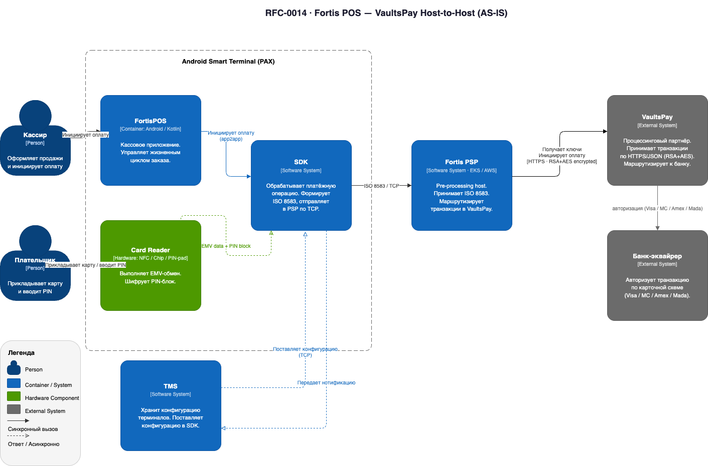
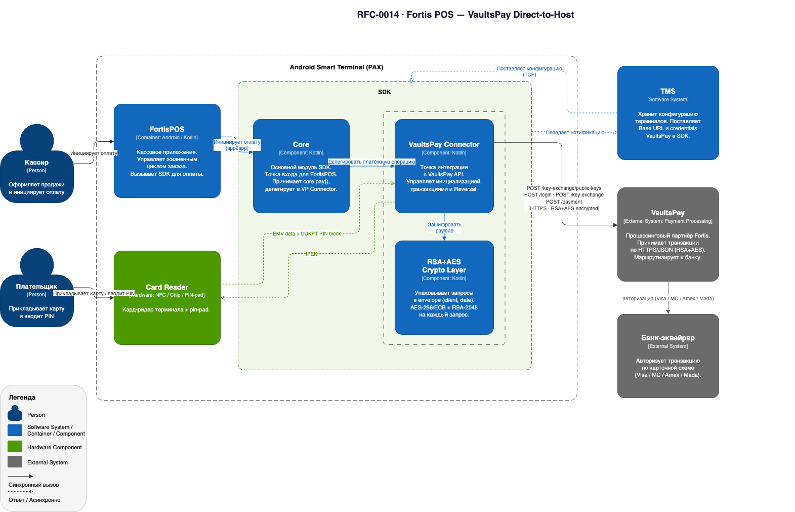
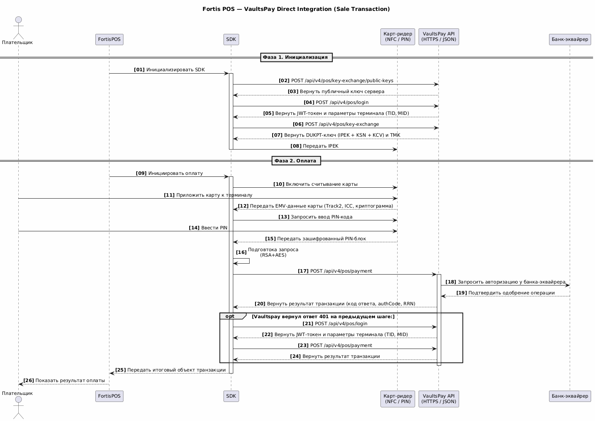

# RFC-0014: Device2Host интеграция с вендором процессинга

> **Источник:** [Confluence](https://bz.incdb.team/pages/viewpage.action?pageId=3425697999)

**Автор:** Небелёнов Евгений

**Дата принятия:** 2026-05-14

**Срок действия:** 2026-09-14

**Начало реализации:** 2026-04-28

**Статус:** Approved

---

## Проблема и контекст

### Проблема

Fortis не является лицензированным Payment Service Provider (PSP) в ОАЭ. Согласно [Retail Payment Services and Card Schemes (RPSCS) Regulation ЦБ ОАЭ](https://rulebook.centralbank.ae/en/rulebook/retail-payment-services-and-card-schemes-regulation), любая деятельность по промежуточной обработке и маршрутизации карточных транзакций требует соответствующей лицензии. Для запуска карточного эквайринга на собственных терминалах PAX в регионе MENA необходимо выбрать схему интеграции с процессинговым партнёром (VaultsPay), которая не создаёт у Fortis функций нелицензированного платёжного посредника.

Изначально интеграция с VaultsPay проектировалась по схеме **Host-to-Host (H2H)**: POS-терминал передаёт транзакцию на Fortis PSP, который маршрутизирует её в VaultsPay.

Однако регуляторные требования Центрального Банка ОАЭ не позволяют использовать H2H-схему для данного типа интеграции. В результате необходимо перейти на схему **Device-to-Host (D2H)**: транзакция идёт напрямую с терминала в VaultsPay, минуя Fortis PSP.

### Бизнес-обоснование

* **Заказчик:** продуктовая команда Fortis (MENA)
* **Бизнес-цель:** запустить карточный эквайринг на собственных терминалах PAX A950 через VaultsPay в регионе MENA в рамках регуляторных требований ЦБ ОАЭ
* **Стоимость бездействия:** невозможность запустить пилот в MENA

### Контекст

**Исходная архитектура:**

**Целевые технологии:** Android (Kotlin), SDK, VaultsPay REST API (HTTPS/JSON), DUKPT (ANSI X9.24-3).

**Зависимости:** TMS (конфигурация, нотификации), VaultsPay (TID/MID/credentials), PAX.

**Ограничения:**

* Регуляторные требования ЦБ ОАЭ: H2H-схема недопустима для данного типа интеграции
* L3 EMV-сертификация: требуется, стоимость и сроки уточняются у VaultsPay
* RSA Key Exchange: однократная операция за жизнь терминала; восстановление только через поддержку VaultsPay
* H2H-реализация почти завершена, может быть использована в будущем (в режиме переключения D2H/H2H)
* D2H требует новой разработки на стороне SDK

---

## Предлагаемое решение

Реализовать **Device-to-Host** интеграцию с VaultsPay в SDK на Android-устройстве. Fortis PSP исключаются из транзакционного потока.

SDK получает конфигурацию от TMS и самостоятельно выполняет всю цепочку взаимодействия с VaultsPay: обмен RSA-ключами, аутентификацию, получение DUKPT-ключей, формирование зашифрованных транзакционных запросов, обработку ответов и Reversal. FortisPOS инициирует платёжную операцию через SDK и асинхронно получает результат. Детали протокола VaultsPay от FortisPOS скрыты.

Управление парком терминалов остаётся под контролем Fortis. TMS полностью эксплуатируется инженерами Fortis: конфигурации терминалов публикуются и обновляются на стороне Fortis без участия VaultsPay.

**Схема зависимостей и sequence diagrams:**

**High-level flow:**

---

## Альтернативы

| Альтернатива | Плюсы | Минусы | Почему не выбрана |
|---|---|---|---|
| **Host-to-Host через Fortis PSP** | Полный контроль над маршрутизацией; централизованный мониторинг; гибкость для будущего Payment Facilitator; легче менять апстрим-процессор; разработка почти завершена | Дополнительная точка отказа; операционная сложность; инфраструктурная нагрузка (HSM, мониторинг) | **Заблокировано регуляторными требованиями ЦБ ОАЭ** |

---

## Компромиссы и технический долг

### Компромиссы

* **Снижение стратегической гибкости.** D2H делает Fortis более зависимым от VaultsPay как транзакционного хоста. Переход к другому процессору или к модели Payment Facilitator с прямым подключением к схемам (Visa/MC) в будущем потребует изменений на стороне терминала, а не только на стороне хоста. Этот компромисс принят как вынужденный ввиду регуляторного ограничения.
* **Дополнительные усилия по разработке.** H2H-реализация была почти завершена; D2H требует новой разработки VaultsPay Connector, DUKPT Engine и RSA+AES Crypto Layer в SDK с нуля. Принят как неизбежный.
* **RSA Key Exchange — необратимая операция.** Утеря RSA-приватного ключа = ручной сброс через поддержку VaultsPay. Принят ввиду отсутствия альтернативы на стороне вендора.
* **JWT без стандартного TTL.** VaultsPay не возвращает время жизни токена; повторная аутентификация — только после ответа HTTP 401.

### Технический долг

| Описание | Категория | План устранения | Срок |
|---|---|---|---|
| L3 EMV-сертификация: стоимость и сроки не финализированы | Критичный | Финализация с VaultsPay после подписания соглашения | TBD |
| Зависимость от VaultsPay как единственного хоста: переход к другому процессору потребует изменений в SDK | Управляемый | Проектирование Connector с абстракцией IPaymentHost для замены вендора без переписывания SDK | TBD |

---

## Ресурсы и нагрузка

* Нагрузка на бэкенд Fortis: отсутствует — трафик идёт Device-to-Host напрямую с терминала в VaultsPay.
* Нагрузка на TMS: конфигурационные запросы при запуске SDK и отправка нотификаций, не изменяется.

---

## Информационная безопасность

* **Хранение/обработка ПД:** Нет — персональные данные пользователей не собираются и не хранятся.
* **Данные скоупа PCI DSS:** PAN обрабатывается в памяти SDK в рамках транзакции и не сохраняется; PIN покидает карт-ридер только в зашифрованном виде (DE52) и никогда не присутствует в открытом виде на уровне SDK.
* **Публичное API:** У Vaultspay нет публичного API.
* **Основные угрозы:** утеря RSA private key.
* **Меры защиты:** уникальный DUKPT-ключ на каждую транзакцию (ANSI X9.24-3); HTTPS + RSA+AES envelope с уникальным AES-256 на каждый запрос.

---

## План реализации

* **Этап 1:** Финализация соглашения с VaultsPay
* **Этап 2:** Реализация модулей в SDK, доработка конфигураций TMS и отправка нотификаций
* **Этап 3:** Интеграционное тестирование на PAX A950 (UAT VaultsPay)
* **Этап 4:** L3 EMV-сертификация (параллельно с разработкой)
* **Этап 5:** Пилотный запуск — первая живая транзакция на PAX A950

**Оценка трудозатрат:** TBD

**Зависимости:** нет.

**Критерии готовности:**

* первая Sale-транзакция на PAX A950 в продуктивной среде;
* покрыты сценарии Sale/Refund/Void/Reversal/401 re-login
* L3 EMV-сертификация пройдена.

---

## Метрики успеха

* **Бизнес:** первая живая транзакция — успешная авторизация карточного платежа реального покупателя с фактическим списанием средств и зачислением на счёт мерчанта.
* **Технические:**
  * Payment Success Rate — доля транзакций, завершившихся с DE39=00, от общего числа попыток. Целевое значение — TBD по результатам пилота (Июнь 2026).
  * Latency и error rate — TBD после UAT, конкретные SLA со стороны VaultsPay не предоставлены.

---

## Источники

* [Интеграция VaultsPay](https://bz.incdb.team/pages/viewpage.action?pageId=3404890763)
* [Шифрование и обмен ключами VaultsPay](https://bz.incdb.team/pages/viewpage.action?pageId=3404890767)
* [Протокол транзакций VaultsPay](https://bz.incdb.team/pages/viewpage.action?pageId=3416523022)
* [Workshop VaultsPay 20.04.2026](https://bz.incdb.team/pages/viewpage.action?pageId=3422421223)
* [Workshop VaultsPay 01.04.2026](https://bz.incdb.team/pages/viewpage.action?pageId=3416522931)
* [Mobile Application — FortisPOS](https://bz.incdb.team/pages/viewpage.action?pageId=3363537138)
